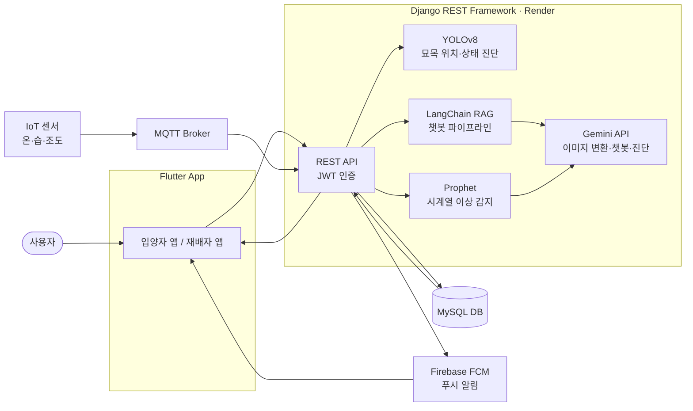
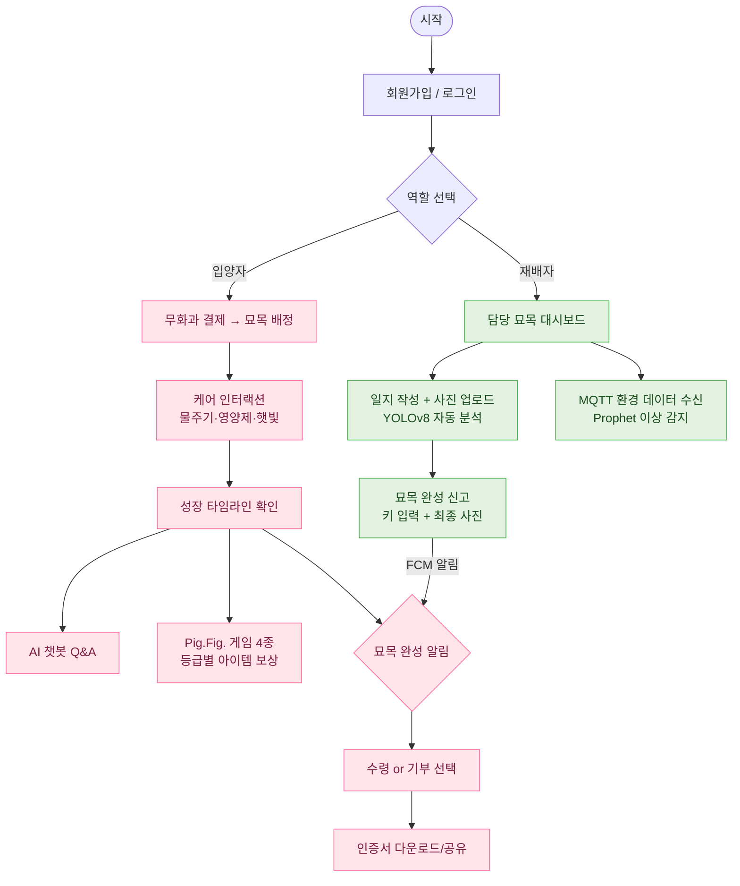
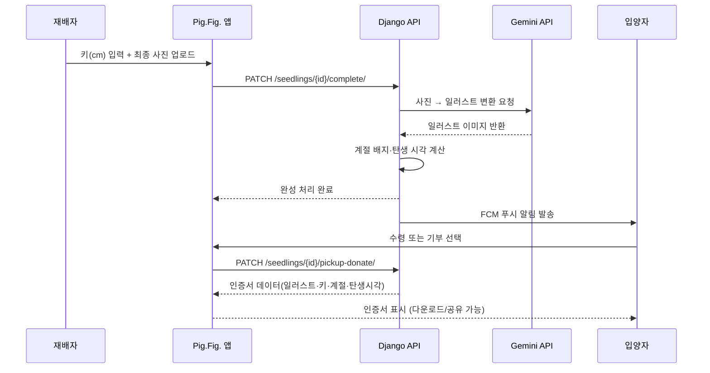
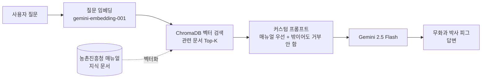

# 🐷🌿 Pig.Fig. (피그피그)

제7회 PNU 창의융합AI해커톤 · 지정과제트랙(MiniFarm랩) · 팀 루트(Root)

## 목차

1. [프로젝트 소개](#1-프로젝트-소개)
2. [상세설계](#2-상세설계)
3. [개발결과](#3-개발결과)
4. [피드백 반영 및 개선사항](#4-피드백-반영-및-개선사항)
5. [설치 및 사용 방법](#5-설치-및-사용-방법)
6. [소개 및 시연영상](#6-소개-및-시연영상)
7. [팀 소개](#7-팀-소개)
8. [해커톤 참여 후기](#8-해커톤-참여-후기)

---

### 1. 프로젝트 소개

#### 1.1. 개발배경 및 필요성

현재 한국 사회는 세 가지 구조적 문제가 동시에 심화되고 있습니다.

**① 도심 공실 문제**
부산 원도심의 경우 2024년 3분기 기준 부산대 상권 23.37%, 남포동 19.75%의 소규모 상가 공실률이 기록되었습니다. 학령인구 감소·온라인 소비 확대·자영업 폐업 증가가 맞물리며 공실 문제는 구조적 문제로 고착화되고 있습니다.

**② 시니어 일자리 부족**
2024년 기준 65세 이상 인구는 전체의 19.2%로 한국은 초고령사회에 진입하였으며, 부산은 이 비중이 23.53%로 전국 평균을 웃돕니다. 55~79세 고령층의 장래 근로 희망자 비율은 69.4%에 달하지만 양질의 시니어 일자리는 여전히 부족합니다.

**③ 반려식물 수요 증가 및 기존 서비스 한계**
국내 반려식물 인구는 약 1,745만 명(전체 인구의 34%)에 달하며, 특히 30대 이하가 37.2%를 차지합니다. 그러나 기존 반려식물 앱은 사용자가 직접 관리하는 구조를 전제하여 시간·환경적 여건이 부족한 수요층을 충족하지 못합니다.

<br/>

#### 1.2. 개발목표 및 주요내용

도심 공실에 무화과 재배 공간을 조성하고, 시니어 재배자가 대신 길러주는 **대리재배 구독 서비스 앱**을 개발합니다. 입양자는 앱을 통해 묘목의 성장 과정을 경험하고, 완성된 묘목을 수령하거나 기부할 수 있습니다.

- 재배 공간과 모바일 플랫폼을 데이터로 연결하는 **재배-플랫폼 연동 구조** 구현
- YOLOv8·Prophet·RAG·Gemini API를 결합한 **AI 기반 재배 진단 시스템** 구축
- 도심 공실 활용·시니어 고용·도시 녹화를 하나의 플랫폼에서 연결하는 **사회적 가치 순환 구조** 실현

<br/>

#### 1.3. 세부내용

**입양자(adopter) 주요 기능**

| 기능 | 설명 |
|------|------|
| 무화과 입양 | 결제(19,900원) 후 묘목 자동 배정 |
| 케어 인터랙션 | 물주기·영양제·햇빛 쬐기 등 생육 단계별 미션 |
| 성장 타임라인 | Gemini API 변환 감성 이미지 기반 성장 기록, 재배자 일지 열람 |
| Pig.Fig. 게임 | 물주기 타이밍·해충 잡기·무화과 퀴즈·돼지 풍선 터뜨리기 4종, 등급별 보상 |
| 수령 / 기부 선택 | 완성 묘목 픽업 수령 또는 3가지 기부처 선택, 디지털 인증서 자동 발급(다운로드·공유) |
| AI 챗봇 | RAG 기반 무화과 재배 Q&A, 매뉴얼 밖 질문도 자연스럽게 응답 |

**재배자(grower) 주요 기능**

| 기능 | 설명 |
|------|------|
| 재배 현황 대시보드 | 담당 묘목 목록 및 상태 확인 |
| 일지 입력 / 사진 업로드 | 성장 기록 작성(본인 작성 일지 삭제 가능), 입양자 타임라인 자동 반영 |
| 환경 데이터 자동 수신 | MQTT로 온도·습도·조도 실시간 수신 |
| 시계열 이상 감지 | Prophet 추세 분석 + Gemini 자연어 진단, 가로 막대그래프 + 기간 필터(7일/30일/전체)로 비교 |
| 묘목 상태 자동 분석 | YOLOv8 서버 추론으로 상태 태그 자동 부착 |
| 묘목 완성 신고 | 재배자가 직접 키(cm)를 입력하고 최종 사진 업로드 → 완성 시각·계절 배지가 기부 인증서에 반영 |

<br/>

#### 1.4. 기존 서비스(상품) 대비 차별성

| 구분 | 그루우·풀박사 | 묘목 판매 플랫폼 | Pig.Fig. |
|------|-------------|----------------|---------|
| 재배-플랫폼 연동 | 없음 | 없음 | MQTT+YOLO+Prophet 실시간 연동 |
| 재배 주체 | 사용자 직접 | 농원 전문 생산 | 시니어 대리재배 |
| AI 활용 | 식물 인식·진단 | 없음 | YOLOv8·Prophet·RAG·Gemini 복합 |
| 사회적 연계 | 없음 | 없음 | 공실 활용·시니어 고용·도시 녹화 |
| 기부 기능 | 없음 | 없음 | 3가지 기부처 선택 + 인증서(사진·계절·탄생시각 포함) |

<br/>

#### 1.5. 사회적가치 도입 계획

- **도심 유휴공간 생산적 전환**: 공실률 20% 전후의 부산 원도심 빈 상가를 무화과 실내 재배 공간으로 전환
- **시니어 친화형 일자리 모델**: 식물 돌봄 중심 재배 직무를 지자체 시니어 일자리 보조금 사업과 연계
- **묘목 기부를 통한 도시 녹화**: 초등학교·복지시설 기증, 도시농업 공동체 연계, 앱 내 나눔 분양
- **푸드 마일리지 저감**: 소비자 인근 도심 재배를 통한 탄소 배출 감소

<br/>

---

### 2. 상세설계

#### 2.1. 시스템 구성도



<br/>

#### 2.2. 사용기술

| 이름 | 버전 |
|:----:|:----:|
| Python | 3.12.4 |
| Django | 6.0.7 |
| Django REST Framework | 3.17.1 |
| djangorestframework-simplejwt | 5.5.1 |
| Flutter | 3.44.x |
| Dart | 3.12.2 |
| MySQL | 8.0 |
| YOLOv8 (Ultralytics) | 8.4.x |
| Prophet | 1.3.x |
| LangChain (core / classic / community) | 1.4.x / 1.0.x / 0.4.x |
| ChromaDB (RAG 벡터스토어) | 1.5.x |
| Google Gemini API | gemini-2.5-flash(텍스트·챗봇·진단), gemini-2.5-flash-image(일러스트 변환) |
| fl_chart (환경 이상 감지 그래프) | 1.2.x |
| Firebase Cloud Messaging | - |
| 배포 | Render(백엔드) |
| **AI 코딩도구** | Claude Code |
| **생성형 AI** | Claude, ChatGPT, Gemini API |

<br/>

---

### 3. 개발결과

#### 3.1. 전체시스템 흐름도

**유저 플로우**



<br/>

#### 3.2. 기능설명

##### `회원가입 / 로그인`
- 이메일과 비밀번호를 입력하면 유효성 검사가 진행됩니다.
- 역할(입양자/재배자)을 선택하여 가입합니다.
- 로그인 성공 시 JWT Access/Refresh 토큰이 발급됩니다.
- 회원탈퇴는 소프트 삭제(`is_active=False`)로 처리되어 일지·타임라인 데이터가 보존됩니다.

##### `무화과 입양 (입양자)`
- 서비스 소개 확인 후 결제(19,900원)를 진행합니다.
- 결제 완료 시 재배중인 묘목이 가장 적은 재배자에게 자동 배정됩니다.

##### `케어 인터랙션 (입양자)`
- 오늘의 미션(물주기·영양제·햇빛)이 표시됩니다.
- 버튼 터치 시 애니메이션이 재생되며 완료 처리됩니다.

##### `성장 타임라인 (입양자)`
- 재배자가 업로드한 사진이 Gemini API로 감성 일러스트로 변환됩니다.
- 날짜별 성장 단계가 카드 형태로 표시됩니다.

##### `Pig.Fig. 게임 (입양자)`
- 물주기 타이밍, 무화과 퀴즈, 해충 잡기, 돼지 풍선 터뜨리기 4종의 미니게임을 즐길 수 있습니다.
- 점수 구간(50/70/90점)에 따라 브론즈·실버·골드 등급이 매겨지고, 등급별로 케어 아이템을 보상으로 받습니다.

##### `재배 현황 대시보드 (재배자)`
- 담당 묘목 목록과 MQTT 수신 센서 데이터가 표시됩니다.
- "환경 이상 감지 요약" 화면에서 담당 묘목별 이상 감지 건수를 가로 막대그래프로 비교하고, 최근 7일/30일/전체 기간 필터를 적용할 수 있습니다.

##### `일지 입력 / 사진 업로드 (재배자)`
- 사진 업로드 시 YOLOv8이 묘목 상태를 자동 분석합니다.
- 재배자 본인이 작성한 일지는 확인 다이얼로그를 거쳐 삭제할 수 있습니다(완료된 묘목의 일지는 삭제 불가).

##### `묘목 완성 신고 (재배자)`
- 재배자가 실측한 키(cm)를 직접 입력하고 최종 사진을 업로드합니다.
- 최종 사진은 Gemini로 일러스트 변환되어 기부 인증서에 반영됩니다.
- 완성 시각을 기준으로 계절 배지(예: "한여름에 완성됐어요 ☀️")가 자동으로 붙습니다.

##### `수령 / 기부 선택 및 인증서 (입양자)`
- 묘목 완성 알림 수신 후 픽업 수령 또는 3가지 기부처를 선택합니다.
- 기부 선택 시 최종 사진 일러스트·키·계절 배지·완성 시각이 담긴 디지털 인증서가 자동 발급되며, 이미지 저장과 공유가 가능합니다.

**묘목 완성 신고 → 기부 인증서 발급 흐름**



##### `AI 챗봇 (입양자)`
- 농촌진흥청 매뉴얼 기반 RAG 파이프라인으로 재배 질문에 답합니다.
- 매뉴얼에 없는 질문도 거부하지 않고 일반 지식으로 자연스럽게 답하되, 확실하지 않은 내용은 단정하지 않습니다.



<br/>

#### 3.3. 기능명세서

| 라벨 | 이름 | 상세 |
|:---:|:---:|:---|
| A1 | 회원가입 | 이메일 중복 검증, 역할(adopter/grower) 선택, 비밀번호 해시 저장 |
| A2 | 로그인 | 이메일/비밀번호 검증, JWT Access+Refresh 토큰 발급 |
| A3 | 회원탈퇴 | 본인 계정 소프트 삭제(`is_active=False`), 재배자 화면에는 "탈퇴한 계정" 배지로 표시 |
| S1 | 묘목 입양 | 입양자만 생성 가능, 재배중 묘목이 가장 적은 재배자 자동 배정 |
| S2 | 묘목 조회 | adopter는 본인 묘목만, grower는 담당 묘목만 조회 |
| S3 | 묘목 완성 신고 | 재배자 실측 키 입력(30cm 미만은 경고만, 차단 없음) + 최종 사진 → Gemini 일러스트 변환, 계절 배지·탄생 시각 자동 생성 |
| S4 | 수령/기부 선택 | 완성된 묘목만 가능, 기부 시 디지털 인증서 자동 발급(다운로드·공유) |
| D1 | 일지 작성 | 재배자만 작성 가능, 사진 업로드 시 YOLOv8 자동 분석 |
| D2 | 일지 조회 | 해당 묘목 관련 사용자만 조회 가능 |
| D3 | 일지 삭제 | 본인이 작성한 일지만 삭제 가능, 완료된 묘목의 일지는 삭제 불가 |
| SE1 | 센서 데이터 수신 | MQTT 자동 수신, Prophet 이상 감지, Gemini 진단 메시지 생성 |
| SE2 | 이상 감지 이력 조회 | `?days=` 쿼리로 최근 N일 필터링, 프론트는 가로 막대그래프로 시각화 |
| V1 | 이미지 분석 | YOLOv8 서버 추론, 묘목 상태 태그 자동 부착 |
| C1 | 챗봇 질의 | RAG 파이프라인, 농촌진흥청 매뉴얼 기반 응답 + 매뉴얼 밖 질문도 자연스럽게 응답 |
| N1 | 푸시 알림 | FCM, 묘목 완성·수령/기부 확정 이벤트 트리거 |

<br/>

#### 3.4. 디렉토리 구조

```
pigfig/
├── backend/                        # Django REST Framework
│   ├── config/                     # 프로젝트 설정
│   │   ├── settings.py
│   │   └── urls.py
│   ├── accounts/                   # 사용자 인증 (JWT, 회원탈퇴 소프트 삭제)
│   ├── seedlings/                  # 묘목 관리, 완성 신고, 수령/기부
│   ├── diary/                      # 재배자 일지, 사진 업로드, 일러스트 변환, 삭제
│   ├── sensor/                     # MQTT 센서 데이터 수신·이상 감지·기간 필터
│   ├── vision/                     # YOLOv8 이미지 분석
│   ├── chatbot/                    # RAG 챗봇 (LangChain + ChromaDB + Gemini)
│   ├── notifications/              # FCM 푸시 알림
│   ├── requirements.txt
│   └── manage.py
├── frontend/                       # Flutter 앱
│   ├── lib/
│   │   ├── core/                   # 네트워크·저장소·테마 등 공통 모듈
│   │   ├── shared/                 # 공용 위젯(앱바, 버튼, 상태 배지 등)
│   │   └── features/
│   │       ├── auth/               # 로그인/회원가입/회원탈퇴
│   │       ├── adopter/            # 입양자 화면 (홈·게임·타임라인·마이페이지)
│   │       └── grower/             # 재배자 화면 (홈·일지·환경점검·마이)
│   ├── test/                       # 위젯·단위 테스트
│   └── pubspec.yaml
├── docs/                           # AI 도구 활용 보고서 등
├── CLAUDE.md
├── AGENTS.md
├── DB_SCHEMA.md
├── DESIGN.md
├── CONTRIBUTING.md
└── README.md
```

<br/>

#### 3.5. AI 도구 활용

| 단계 | 도구 | 활용 내용 | 성과 |
|------|------|-----------|------|
| 기획·문서 | Claude, ChatGPT | 요구사항 분석, 계획서·README 작성 | 기획 소요 시간 단축 |
| UI 설계 | Figma AI, Claude Design | 핵심 화면 초안 텍스트 프롬프트 생성 및 디자인 시안 제작 | 디자인-개발 일관성 확보 |
| 백엔드·프론트 개발 | Claude Code | Django API, Flutter 화면, MQTT, YOLOv8 추론 API 구현 및 버그 수정 | 반복 코드 작업 절감, 계획 승인 후 구현하는 검증 루프로 회귀 방지 |
| 발표자료 제작 | Canva AI | 최종발표 PPT 디자인 및 슬라이드 구성 | 발표 소요 시간 단축 |
| AI 모델 | YOLOv8 | Fig Leaves Dataset(healthy/infected) 기반 YOLOv8n-cls 파인튜닝, Google Colab(Tesla T4) 학습(val top1 97%) | 묘목 상태 자동 진단 |
| AI 모델 | Prophet | 센서 시계열 데이터 기반 이상 감지 모델 구축 | 임계값 이전 이상 징후 예측 |
| AI 모델 | LangChain + Gemini + ChromaDB | 농촌진흥청 매뉴얼 벡터화, RAG 챗봇 구현, 커스텀 프롬프트로 응답 톤 개선 | 도메인 특화 정확도 향상, 매뉴얼 밖 질문도 자연스럽게 응답 |
| 서비스 내 AI | Google Gemini API | 묘목 사진 감성 일러스트 변환, 센서 이상 자연어 진단 | 입양자 감성 경험 차별화 |

자세한 AI 활용 범위와 검증 방식은 [`docs/ai-usage.md`](docs/ai-usage.md)를 참고해주세요.

<br/>

---

### 4. 피드백 반영 및 개선사항

#### 4.1. 예선 심사 피드백 반영

**5월 예선 심사**에서 다음 두 가지 피드백을 받았습니다.

- 게이미피케이션보다 **재배 운영·배송 프로세스 검증**을 우선할 것
- **기능 우선순위 재조정** 필요

이를 반영해 수정 개발계획서에서 서비스 핵심을 게이미피케이션(돼지 퇴치) 중심에서 **재배-플랫폼 연동 데이터 파이프라인** 중심으로 재정의했습니다.

| 구분 | 예선 계획서 | 수정 계획서 |
|------|-------------|-------------|
| 서비스 핵심 | 게이미피케이션(돼지 퇴치) 강조 | 재배-플랫폼 연동 데이터 파이프라인 강조 |
| 환경 감지 | 재배자 수동 입력 | MQTT 자동 수신(가상 센서 → 실제 센서 교체 가능 구조) |
| 묘목 상태 분석 | TensorFlow 단순 4분류 | YOLOv8 서버 추론으로 고도화 |
| 이상 감지 | 임계값 단순 비교 | Prophet 시계열 추세 기반 예측으로 고도화 |
| 챗봇 | Gemini 일반 응답 | RAG 기반 도메인 특화 챗봇(농촌진흥청 매뉴얼 연동) |
| 게이미피케이션 | 핵심 기능으로 분류 | 리텐션 보조 수단으로 후순위 재배치 |

<br/>

#### 4.2. DRB동일 현장 방문 멘토링 피드백

**기술적·기획적 보완사항**

- 서비스 구조가 결제 → 배정 → 수령의 흐름으로만 읽히면 '온라인 쇼핑몰'처럼 느껴질 위험이 있으며, 당근마켓과 같이 신뢰 기반의 관계와 커뮤니티가 느껴지는 '입양 사이트'로서의 정체성을 강화할 필요가 있다는 의견을 받았습니다.
- 서비스 범위가 묘목 완성 시점(수령/기부)에서 종료되는데, 완성 이후 성체까지 지속적으로 키우고 관계를 이어가는 경험까지 스코프를 확장하는 방안을 검토할 것을 제안받았습니다.
- 정보가 홈·타임라인·케어·환경점검 등 여러 화면에 분산되어 있어, 내 나무의 현재 상태와 다음 케어 일정을 한 화면에서 바로 확인할 수 있는 위젯형 UI 도입이 필요하다는 의견을 받았습니다.
- 실제로 나무를 직접 키우는 듯한 몰입감과 정서적 연결감을 강화하는 방향의 디자인·인터랙션 보완이 필요하다는 의견을 받았습니다.

**기타 향후 보완해야 할 점**

- 서비스만의 강점을 한두 가지로 명확히 정의하고, 이를 중심으로 전체 스토리와 화면 구성을 재정렬할 필요가 있습니다.
- 핵심 가치 제안(Value Proposition)의 재정의가 선행되어야 세부 기능 우선순위도 명확해집니다.

<br/>

#### 4.3. 팀의 학습 내용 및 향후 계획

개발 초기에는 기능 구현과 기술 완성도에 집중하다 보니, 사용자가 서비스를 처음 접했을 때 '이것이 무엇을 하는 서비스로 느껴지는가'라는 인지적 관점을 충분히 고려하지 못했다는 점을 멘토링을 통해 깨달았습니다. 단순히 기능을 나열하는 것이 아니라, 서비스의 정서적 경험과 핵심 강점을 압축적으로 전달하는 것이 사용자 경험 설계에서 중요하다는 것을 배웠습니다.

이를 바탕으로 다음과 같은 방향으로 개선을 진행했습니다.

- 입양 경험을 결제 중심이 아닌 신뢰·커뮤니티 기반으로 재구성 (당근마켓 사례 벤치마킹)
- 묘목 완성 이후에도 성체까지 지속적으로 키우고 관계를 이어갈 수 있는 확장 시나리오 설계
- 재배자 완성 신고에 실측 키·최종 사진·계절 배지·탄생 시각 등 감성적 정보를 추가해, 숫자 나열이 아닌 정서적 경험으로 완성 순간을 재구성
- 완성된 묘목의 기부 인증서에 실제 사진 일러스트를 반영해, 입양자가 "우리 무화과가 실제로 이렇게 자랐다"는 실감을 느끼도록 개선
- 재배자가 담당하는 묘목의 입양자가 탈퇴한 경우에도 데이터를 보존하되, 계정 상태를 배지로 투명하게 안내하는 방식으로 신뢰 기반 관계를 설계

<br/>

---

### 5. 설치 및 사용 방법

#### 5.1. 필요 환경

- Python 3.12 이상
- Flutter 3.x 이상
- MySQL 8.0 이상

#### 5.2. 백엔드

```bash
# 레포지토리 클론
git clone https://github.com/PNU-2026-AI-Hackathon/pnuai-b-05-root.git
cd pnuai-b-05-root/backend

# 가상환경 생성 및 활성화
python -m venv venv
venv\Scripts\activate        # Windows
source venv/bin/activate     # Mac/Linux

# 패키지 설치
pip install -r requirements.txt

# 환경변수 설정
cp .env.example .env
# .env 파일에 DB 정보, GEMINI_API_KEY 등 실제 값 입력

# DB 마이그레이션 및 서버 실행
python manage.py migrate
python manage.py runserver
```

#### 5.3. 프론트엔드

```bash
cd ../frontend

# 패키지 설치
flutter pub get

# 실행 (백엔드가 로컬 8000번 포트에서 실행 중이어야 함)
flutter run -d chrome        # 웹으로 실행
flutter run                  # 연결된 기기/에뮬레이터로 실행
```

> 백엔드가 로컬(8000번 포트)이 아닌 곳에서 실행 중이거나 Android 에뮬레이터에서 테스트할 때는 `frontend/lib/core/network/api_client.dart`의 `baseUrl`을 환경에 맞게 조정해주세요.

<br/>

---

### 6. 소개 및 시연영상

[](https://youtu.be/owBSFzZ0Ol8)

<https://youtu.be/owBSFzZ0Ol8>

<br/>

---

### 7. 팀 소개

| 강서영 | 박소영 | 강효원 |
|:------:|:------:|:------:|
| <ksksyy25@pusan.ac.kr> | <kye625@pusan.ac.kr> | <hwdh0330@pusan.ac.kr> |
| 팀장 · 백엔드 · AI <br/> Django, YOLOv8, Prophet, MQTT, Gemini API | 프론트엔드 <br/> Flutter, FCM, Lottie 애니메이션 | 기획 · 디자인 <br/> Figma AI, Claude Design, UI/UX, RAG 챗봇 프롬프트, Canva AI 발표자료 |

<br/>

---

### 8. 해커톤 참여 후기

- 강서영
  > 비개발자와 함께 개발하는 것은 처음이 아니었지만, 이번에는 팀원이 아니라 팀장으로 참여하면서 완전히 다른 경험을 하게 되었습니다. 예전에는 팀원으로서 큰 갈등 없이 무난하게 프로젝트를 끝냈던 기억만 있었는데, 팀장이 되어보니 목표와 속도를 스스로 정하고 책임져야 한다는 부담감이 생각보다 훨씬 컸습니다. 강의 과제처럼 정해진 틀 안에서 움직이는 것과는 전혀 다른 무게였습니다. 함께했던 이전 팀들의 팀장님들께도 새삼 감사한 마음이 들었습니다.
  >
  > 그래도 어찌저찌 이 자리까지 오게 되어 감사한 마음이 큽니다. 아무래도 팀장이다 보니 어느새 백엔드부터 프론트엔드까지 두루 다뤄보는 풀스택 개발자로서의 소양을 쌓게 된 것도 뜻밖의 소득이었습니다. 힘들었지만 즐거운 여정이었고, 처음 아이디어를 구상할 때 해보고 싶었던 것들을 거의 다 담아낼 수 있어 만족스럽습니다. 이런 자리를 마련해주신 AI융합교육원과, 좋은 주제를 제시해주신 DRB동일 관계자분들께 진심으로 감사드립니다.
- 박소영
  > 이번이 저의 첫 장기 프로젝트였습니다. 평소 스마트팜에 관심이 많아 지정과제 트랙을 보자마자 망설임 없이 참가를 결정했는데, 막상 개발을 시작하니 프론트엔드 화면 하나하나를 실제 사용자 경험에 맞게 다듬는 일이 생각보다 훨씬 까다로웠습니다. 디자인 시안과 실제 구현 사이의 간극을 좁히고, 여러 화면과 상태를 유기적으로 연결하는 과정에서 많은 고민과 시행착오를 거쳤습니다.
  >
  > 힘든 순간도 있었지만 그만큼 배운 것도 많았고, 이번 경험을 통해 스마트팜과 관련 기술에 대한 관심이 오히려 더 커졌습니다. 앞으로도 이 분야를 계속 지켜보고 공부해나가고 싶습니다.
- 강효원
  > 비개발자로 참여하면서 처음에는 제가 팀에 실질적으로 어떤 도움이 될 수 있을지 고민이 많았습니다. 기획과 디자인, 문서화로 기여하려 했지만 개발 흐름을 따라가는 것부터 쉽지 않았습니다. 그런 저를 끝까지 챙겨주고 이끌어준 팀장님께 정말 감사한 마음입니다.
  >
  > 덕분에 이번 해커톤에서 태어나 처음으로 깃허브를 직접 써보게 되었는데, 커밋과 브랜치, 풀리퀘스트로 협업 과정이 기록되고 쌓여가는 것이 무척 신기하고 흥미로웠습니다. 비개발자에게는 낯설었던 개발자들의 세계를 조금이나마 엿볼 수 있었던 값진 시간이었습니다.